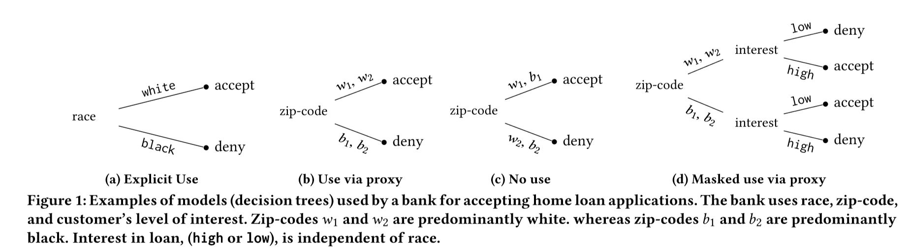

# Ethical Machine Learning
## _A vignette designed to assist with spotting and preventing proxy bias._

----------------------------------

Machine Learning systems often inherit biases against protected classes and historically disparaged groups via their training data [[1]](https://arxiv.org/pdf/1707.08120.pdf). Though some biases in features are straightforward to detect (ex: age, gender, race), others are not explicit and rely on subtle correlations in machine learning algorithms to understand. The incorporation of unintended bias into predictive models is called _proxy discrimination_.

---------------------

_Example of proxy bias in a bank's loan decision workflow._

---------------------

In this vignette, we will be implementing an example machine learning model using decision trees, and determining whether its classification for loan recipients is biased against certain groups. We will explore several ways of detecting unintentional bias and removing it from our predictive model.

**Please note**: the techniques used in this exercise only support _linear models_, _decision trees_, _rule lists_, and _random forests_ - not deep learning models or neural networks. However, the supported models represent a significant fraction of models used in practice in predictive systems that operate on personal information, ranging from advertising [2](http://www.bing.com), psychopathy [3](http://www.bing.com), criminal justice [4](http://www.bing.com), [5](http://www.bing.com), and actuarial sciences [6](http://www.bing.com), [7](http://www.bing.com).

